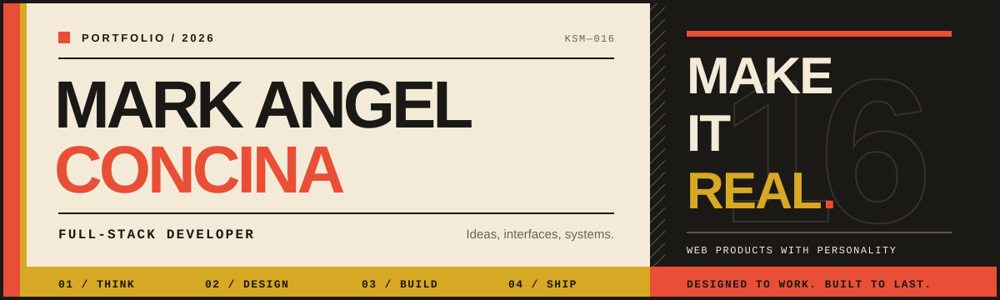

<div align="center">
  

  <br />

  <a href="https://readme-typing-svg.demolab.com">
    
  </a>

  <br />

  <a href="mailto:mrkconcina@gmail.com"></a>
  <a href="https://linkedin.com/in/mark-angel-concina-32a677354"></a>
  
</div>

## Hello, World — I'm Mark

I'm a Full-Stack Developer focused on building reliable, practical, and easy-to-use web applications. Enjoys solving problems,
learning better ways to develop software, and improving through hands-on work. Looking for an opportunity to grow as
a developer, contribute to a team, and build software that people can actually use.

```ts
const kingsmark16 = {
  role: "Full-stack developer",
  approach: ["think clearly", "design intentionally", "ship reliably"],
  currentMission: "Turn ambitious ideas into memorable products",
  openTo: ["collaboration", "interesting problems", "building useful things"],
};
```

## Selected work

<table>
  <tr>
    <td width="50%" valign="top">
      <h3>🎓 PARSUWise</h3>
      <p>A full-stack learning platform with role-based experiences, course authoring, quizzes, real-time forums, progress analytics, and verifiable certificates.</p>
      <p><code>React 19</code> <code>Express</code> <code>PostgreSQL</code> <code>Prisma</code> <code>Socket.IO</code></p>
      <p><a href="https://parsuwise.onrender.com"><strong>Live experience ↗</strong></a> · <a href="https://github.com/kingsmark16/PARSUWise">Source</a></p>
    </td>
    <td width="50%" valign="top">
      <h3>💌 Confession</h3>
      <p>An interactive pop-art love story with a paginated letter, music, memories, an animated garden, and anonymous responses stored with Supabase.</p>
      <p><code>React</code> <code>TypeScript</code> <code>Vite</code> <code>Supabase</code> <code>Azure</code></p>
      <p><a href="https://confession4u.mcanghel.fun"><strong>Live experience ↗</strong></a> · <a href="https://github.com/kingsmark16/Confession">Source</a></p>
    </td>
  </tr>
  <tr>
    <td width="50%" valign="top">
      <h3>📼 CollegeRage</h3>
      <p>A “vault of chaos” for preserving college memories, packaged as a production-style multi-container app with an Nginx gateway and persistent data.</p>
      <p><code>React</code> <code>Express</code> <code>Docker</code> <code>Nginx</code> <code>Neon</code></p>
      <p><a href="https://collegerage-fzahg5ekarathpf3.southeastasia-01.azurewebsites.net"><strong>Live experience ↗</strong></a> · <a href="https://github.com/kingsmark16/CollegeRage">Source</a></p>
    </td>
    <td width="50%" valign="top">
      <h3>✨ Portfolio</h3>
      <p>A motion-rich personal showcase for selected projects, services, experience, education, and the thinking behind the work.</p>
      <p><code>Next.js</code> <code>TypeScript</code> <code>GSAP</code> <code>Vercel</code></p>
      <p><a href="https://github.com/kingsmark16/portfolio"><strong>Explore the source ↗</strong></a></p>
    </td>
  </tr>
</table>

<details>
  <summary><strong>More experiments from the lab</strong></summary>
  <br />
  <a href="https://github.com/kingsmark16/Letterly">Letterly</a> ·
  <a href="https://github.com/kingsmark16/heuristic-evaluation-web-reporting-site">Heuristic Evaluation Report</a> ·
  <a href="https://github.com/kingsmark16/React-Quiz-App">React Quiz App</a>
</details>

## The toolbox

<div align="center">
  
</div>

| I use | Technologies |
| :-- | :-- |
| **Frontend** | TypeScript, React, Next.js, Tailwind CSS, Vite, GSAP |
| **Backend** | Node.js, Express, NestJS, REST APIs, Socket.IO |
| **Data** | PostgreSQL, MySQL, MongoDB, Redis, Supabase, Prisma |
| **Delivery** | Docker, Nginx, Azure, AWS, Vercel, GitHub Actions |
| **Craft** | Stitch AI, Figma, responsive design, accessibility, testing |

## GitHub signal

<div align="center">
  
  
</div>

<div align="center">
  
</div>

## Let's make something worth remembering

I enjoy projects where thoughtful engineering and personality can coexist. If you have an idea, an open-source project, or a problem that deserves a polished solution, **let's talk**.

<div align="center">
  <a href="mailto:mrkconcina@gmail.com"></a>
  <a href="https://linkedin.com/in/mark-angel-concina-32a677354"></a>
  <a href="https://instagram.com/mc.anghel"></a>
  <a href="https://facebook.com/mcanghel.concina"></a>
  <a href="https://tiktok.com/@kingsmark16"></a>
</div>

<div align="center">
  <sub>Designed with intention. Built with curiosity. Shipped by <a href="https://github.com/kingsmark16">@kingsmark16</a>.</sub>
</div>
